Adjectives Exp1-Exp2 Results
================
Barbara Tomaszewicz
12/7/2018

Relative & Absolute Adjectives
==============================

The distribution of degree modifiers (*almost*, *slightly*) reveals that **gradable adjectives** can be grouped in **three classes** which differ in the structure of the **scales** they are associated with. (Grammatical effects = any theory must account for this, e.g. you can't say all interepretation differences come just from the context.)

**Relative Adjectives**

-   The scale for *tall* has no endpoints that *almost* and *slightly* could reference, see (1).
-   The value of the **threshold *d*** needs to be determined **relative** to the **context** supplying the ‘comparison class’ (a relevant set of individuals, e.g. jockeys or basketball players.)

1.  John is ??almost/??slightly tall/short.

    pos tall = λx \[tall(x) ≥ d\]

**Absolute Adjectives: Min & Max**

-   The scale for *dirty* has a bottom endpoint (minimum), and *slightly* picks out a degree close to that endpoint, see (2a).
-   The scale for *clean* has a top endpoint (maximum) that *almost* can modify, see (2b).
-   Adjectives with (partially) closed scales are called **absolute** because they **don’t require context** for interpretation. One proposal: they differ from relative adjectives in that the **min/max endpoints** are lexically encoded as the thresholds.

1.  1.  This towel is ??almost/slightly dirty.

        pos wet = λx \[wet(x) ≥ min\]

    2.  This towel is almost/??slightly clean.

        pos dry = λx \[dry(x) ≥ max\]

Absolute adjectives can also have interpretations that **deviate from the min/max threshold**, e.g. the context-invariant threshold for *full* is 100%, but the appropriate threshold for the whiskey-glass context is around 30%. --&gt; Idea: **pragmatic processes** allow for a wider region of the scale to count as full (Kennedy 2007).

Prior experiments
=================

In a series of Yes-No Judgment tasks Kim et al. (2013, 2014) and Leffel et al. (2017) (Kennedy's 'Chicago Group') find that **only absolute adjectives show signs of having context-invariant, precise meanings**. Leffel et al. (2017) show that absolute adjectives easily allow deviation from the min/max threshold when predicated of **familiar artifacts** (with familiar, well-defined comparison classes) in contrast to **abstract geometrical shapes**, e.g. a shirt with one stripe is less likely to be judged as striped (60%) than a square (80%), Fig 1.

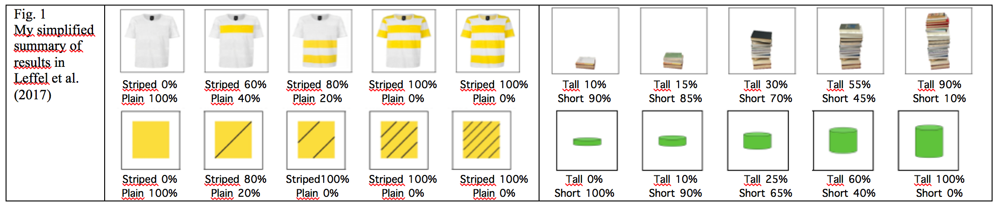

A shift in the threshold was also found for **relative adjectives**, but for both a stack of books and a cylinder the **threshold is mid-way** on the scale (Fig.1, tall stack 30%, tall cylinder 25%), suggesting that in each case it is computed on the basis of the comparison class in the **local (visual) context**.

Our Research Question
=====================

-   Is the **mid-way location of *d*** on the scales for **relative** adjectives **lexically encoded**?
-   Or is it a **side-effect of the task**s requiring a decision between two antonyms?

**Our Experiment**: Using the same paradigm, but asking for a Yes-No judgment with respect to a **single property** (Fig. 2), we compared the **effect of world knowledge** (comparison classes of familiar everyday objects) on deviation from min/max endpoints vs. the setting of the relative threshold (n=72).

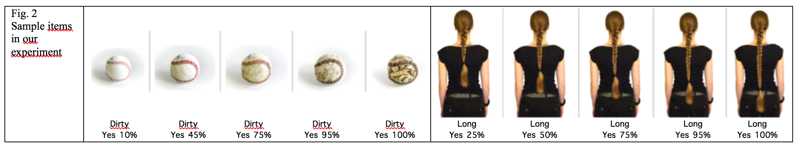

It is plausible to assume that **everyday objects** come not only with a specified dimension but also **part of the scale**. E.g., all of the braids in Fig. 2 can all be described as *long*, so including *short* among the options in the task may introduce a presupposition that at least one of them is short in some context.

**Prediction:** If world-knowledge is actively involved in judgments with absolute adjectives, but not relative adjectives, the thresholds with **absolute** adjectives should **shift** as in Leffel et al. 2017, while with **relative** adjectives the judgments should still reflect the **local context** (i.e., the comparison class in the picture). --&gt; If absolute and relative adjectives shift their thresholds in a similar way, an EEG study will reveal if the SAME conditions where the current experiment elicited yes-judgments are, nevertheless, associated with two DISTINCT **cognitive mechanisms** for setting the threshold with relative adjectives (semantics?) and for deviation from the min/max thresholds with absolute adjectives (pragmatics?).

Our Data
========

Exp 1
=====

``` r
library(plyr)
library(ggplot2)
library('lme4')
library(lmerTest)
```

``` r
# load just the data of target item ratings (no fillers, no timing data)
target_ratings_Exp1 <- read.csv("AbsoluteRelativeExp1-FlipMax.csv")
target_ratings_Exp1$X <- NULL
target_ratings_Exp1$degree2 <- as.factor(target_ratings_Exp1$degree2)

str(target_ratings_Exp1)
```

    ## 'data.frame':    15120 obs. of  17 variables:
    ##  $ subject      : Factor w/ 72 levels "556db1d1fdf99b26054b1774",..: 35 43 46 31 17 42 22 9 49 64 ...
    ##  $ item         : Factor w/ 420 levels "b1__item_1.dick..left.right...Q1.9.1...Q1.9.1",..: 81 81 81 81 81 81 81 81 81 81 ...
    ##  $ value        : int  1 1 1 1 1 1 1 1 NA 1 ...
    ##  $ measure      : Factor w/ 1 level "rating": 1 1 1 1 1 1 1 1 1 1 ...
    ##  $ item_type    : Factor w/ 1 level "target": 1 1 1 1 1 1 1 1 1 1 ...
    ##  $ pict_order   : Factor w/ 2 levels "leftno_rightyes",..: 2 2 2 2 2 2 2 2 2 2 ...
    ##  $ adjective    : Factor w/ 28 levels "dick","dreckig",..: 7 7 7 7 7 7 7 7 7 7 ...
    ##  $ adj_type     : Factor w/ 3 levels "max","min","relative": 1 1 1 1 1 1 1 1 1 1 ...
    ##  $ pict_position: int  1 1 1 1 1 1 1 1 1 1 ...
    ##  $ noun         : Factor w/ 84 levels "angelhaken","apfelsaft",..: 4 4 4 4 4 4 4 4 4 4 ...
    ##  $ group        : Factor w/ 2 levels "Abs","Rel": 1 1 1 1 1 1 1 1 1 1 ...
    ##  $ series       : Factor w/ 84 levels "Abs1-b1__item_1",..: 9 9 9 9 9 9 9 9 9 9 ...
    ##  $ newcol       : Factor w/ 10 levels "leftno_rightyes_01",..: 6 6 6 6 6 6 6 6 6 6 ...
    ##  $ degree       : int  5 5 5 5 5 5 5 5 5 5 ...
    ##  $ block        : Factor w/ 3 levels "b1","b2","b3": 1 1 1 1 1 1 1 1 1 1 ...
    ##  $ degree2      : Factor w/ 5 levels "1","2","3","4",..: 1 1 1 1 1 1 1 1 1 1 ...
    ##  $ value2       : int  0 0 0 0 0 0 0 0 NA 0 ...

In Exp1, 14 relative and 14 absolute (8 max, 6 min) adjectives were tested. Relative and absolute adjectives were rated by different groups of participants (between-subjects design). Here we are looking at the two sub-groups of absolute adjectives (max and min) separately. We see there were 72 participants (subject), and 420 pictures with yes/no judgments (item). The pictures/items were presented in a series of 5, so series/noun is the relevant factor. I.e., for each adjective, there was a series of 5 pictures showing an object ('noun') with 5 degrees of the property. The order in a series was counterbalanced between “leftno\_rightyes” order (as in Fig.2), and “reversed” order (hence, fixed effect).

``` r
# adjective types => looking at the columns with condition codes
atypes1 <- unique(target_ratings_Exp1[, c("group", "adj_type","adjective")])
table(atypes1$group)
```

    ## 
    ## Abs Rel 
    ##  14  14

``` r
table(atypes1$adj_type)
```

    ## 
    ##      max      min relative 
    ##        8        6       14

Each adjective was tested with 3 nouns and series of 5 pictures for each adjective-noun combination. This gave 42 series for Rel, and 24 series for Max and 18 series for Min. Because there is 1 series for 1 noun, these factors are equivalent.

``` r
atypes <- unique(target_ratings_Exp1[, c("group", "adj_type","adjective", "noun")])
atypes[order(atypes$group, atypes$adj_type, atypes$adjective),]
```

    ##       group adj_type   adjective              noun
    ## 1       Abs      max      gerade            banane
    ## 1441    Abs      max      gerade    blumenstaengel
    ## 2881    Abs      max      gerade         strohhalm
    ## 181     Abs      max geschlossen              auge
    ## 1621    Abs      max geschlossen           flasche
    ## 3061    Abs      max geschlossen             jacke
    ## 361     Abs      max       glatt  frischhaltefolie
    ## 1801    Abs      max       glatt             haare
    ## 3241    Abs      max       glatt         serviette
    ## 541     Abs      max        klar         apfelsaft
    ## 1981    Abs      max        klar           fenster
    ## 3421    Abs      max        klar         glasperle
    ## 721     Abs      max        leer       chipsbeutel
    ## 2161    Abs      max        leer        luftballon
    ## 3601    Abs      max        leer     pfeffermuehle
    ## 901     Abs      max      sauber        blackboard
    ## 2341    Abs      max      sauber       fusselrolle
    ## 3781    Abs      max      sauber          baseball
    ## 1081    Abs      max     trocken             fleck
    ## 2521    Abs      max     trocken     gesichtsmaske
    ## 3961    Abs      max     trocken holzschneidebrett
    ## 1261    Abs      max        voll        papierkorb
    ## 2701    Abs      max        voll    salatschuessel
    ## 4141    Abs      max        voll          bierglas
    ## 4321    Abs      min     dreckig            dogtoy
    ## 5401    Abs      min     dreckig      schuhbuerste
    ## 6481    Abs      min     dreckig     verkehrskegel
    ## 4501    Abs      min     gebogen   flaschenbuerste
    ## 5581    Abs      min     gebogen             gabel
    ## 6661    Abs      min     gebogen             nagel
    ## 4681    Abs      min   gepunktet             bluse
    ## 5761    Abs      min   gepunktet        dalmatiner
    ## 6841    Abs      min   gepunktet      fliegenpiltz
    ## 4861    Abs      min        nass          handtuch
    ## 5941    Abs      min        nass      sonnenbrille
    ## 7021    Abs      min        nass       canvasschuh
    ## 5041    Abs      min       offen            laptop
    ## 6121    Abs      min       offen     taschenmesser
    ## 7201    Abs      min       offen      federmapchen
    ## 5221    Abs      min       trueb              bier
    ## 6301    Abs      min       trueb             suppe
    ## 7381    Abs      min       trueb      zitronensaft
    ## 7561    Rel relative        dick              buch
    ## 10081   Rel relative        dick            edding
    ## 12601   Rel relative        dick    maennerarmband
    ## 7741    Rel relative       duenn      brottscheibe
    ## 10261   Rel relative       duenn      kuchenstueck
    ## 12781   Rel relative       duenn             nadel
    ## 7921    Rel relative      dunkel     dunkel-banane
    ## 10441   Rel relative      dunkel            lippen
    ## 12961   Rel relative      dunkel             rauch
    ## 8101    Rel relative       gross     kettenhaneger
    ## 10621   Rel relative       gross     gross-ohrring
    ## 13141   Rel relative       gross        schokolade
    ## 8281    Rel relative        hell   hell-armbanduhr
    ## 10801   Rel relative        hell             farbe
    ## 13321   Rel relative        hell        foundation
    ## 8461    Rel relative        hoch          hochbett
    ## 10981   Rel relative        hoch             regal
    ## 13501   Rel relative        hoch        schuabsatz
    ## 8641    Rel relative       klein     klein-ohrring
    ## 11161   Rel relative       klein             socke
    ## 13681   Rel relative       klein            tomate
    ## 8821    Rel relative        kurz    kurz-bleistift
    ## 11341   Rel relative        kurz          minirock
    ## 13861   Rel relative        kurz             schal
    ## 9001    Rel relative        lang    fensterwischer
    ## 11521   Rel relative        lang        lang-nagel
    ## 14041   Rel relative        lang              zopf
    ## 9181    Rel relative      leicht            kissen
    ## 11701   Rel relative      leicht   toilettenpapier
    ## 14221   Rel relative      leicht       wattebausch
    ## 9361    Rel relative     niedrig            stange
    ## 11881   Rel relative     niedrig             stuhl
    ## 14401   Rel relative     niedrig              zaun
    ## 9541    Rel relative      schwer      blumentoepfe
    ## 12061   Rel relative      schwer           buecher
    ## 14581   Rel relative      schwer             stein
    ## 9721    Rel relative       spitz      essstaebchen
    ## 12241   Rel relative       spitz             pfeil
    ## 14761   Rel relative       spitz        angelhaken
    ## 9901    Rel relative      stumpf  stumpf-bleistift
    ## 12421   Rel relative      stumpf      stumpf-gabel
    ## 14941   Rel relative      stumpf             saege

``` r
table(atypes$group)
```

    ## 
    ## Abs Rel 
    ##  42  42

``` r
table(atypes$adj_type)
```

    ## 
    ##      max      min relative 
    ##       24       18       42

Let's plot the % of yes/no judgments for the 3 adjective types:

``` r
target_ratings_Exp1_NoNA <- na.omit(target_ratings_Exp1)

source(file = "Helper_functions-within-subjects-se.R")
datac <- summarySEwithin(target_ratings_Exp1_NoNA, measurevar="value", withinvars=c("degree", "adj_type"), idvar="subject")

ggplot(datac, aes(x=degree, y=value, group=adj_type, colour=adj_type)) +
  geom_errorbar(aes(ymin=value-se, ymax=value+se), size=.75, width=.2) +
  geom_line(aes(linetype=adj_type), size=1.2) +
  geom_point(aes(shape=adj_type), size=4) + theme_bw() +
  theme(legend.key = element_blank(), legend.title = element_text(size=12)) +
  xlab("Degree of Property") + ylab("% Yes")
```

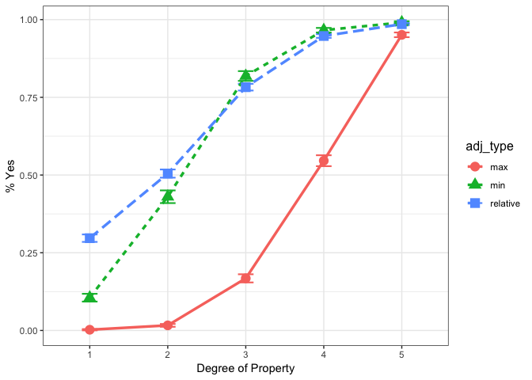

Obviously, Max adjectives are different from the other two types, because to count as e.g. *full* or *closed* you must be towards the end of the scale (05, the maximum), see below:

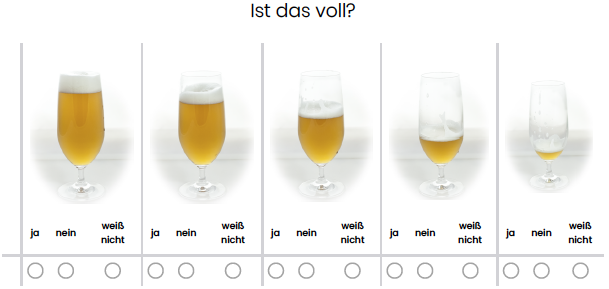

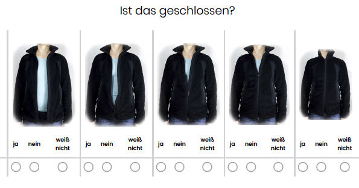

So let's look at the flipped curve of judgments for Max adjectives:

``` r
source(file = "Helper_functions-within-subjects-se.R")
datac <- summarySEwithin(target_ratings_Exp1_NoNA, measurevar="value2", withinvars=c("degree2", "adj_type"), idvar="subject")

ggplot(datac, aes(x=degree2, y=value2, group=adj_type, colour=adj_type)) +
  geom_errorbar(aes(ymin=value2-se, ymax=value2+se), size=.75, width=.2) +
  geom_line(aes(linetype=adj_type), size=1.2) +
  geom_point(aes(shape=adj_type), size=4) + theme_bw() +
  theme(legend.key = element_blank(), legend.title = element_text(size=12)) +
  xlab("Degree of Property") + ylab("% Yes for Min/Rel; % No for Max")
```

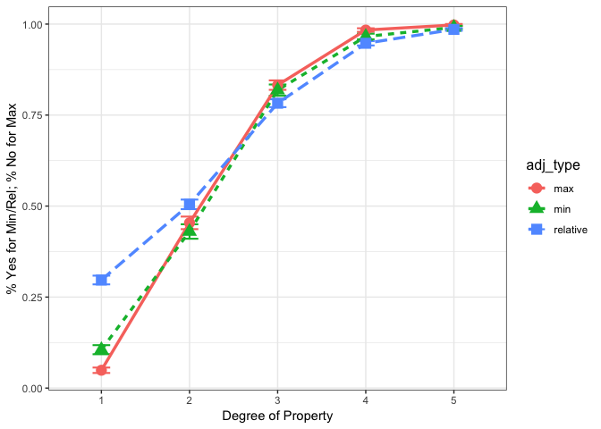

Set Relative as the reference level, so that you can interpret the codes for the conditions after Afex implements sum-coding ("Contrasts set to contr.sum for the following variables: adj\_type, degree2, pict\_order, subject, adjective, noun.") (If relative is the baseline, adj\_type1 is adj\_typemax and adj\_type2 is adj\_typemin.)

``` r
target_ratings_Exp1$adj_type <- relevel(target_ratings_Exp1$adj_type, ref="relative")
contrasts(target_ratings_Exp1$adj_type)
```

    ##          max min
    ## relative   0   0
    ## max        1   0
    ## min        0   1

``` r
Exp1_reduced <- target_ratings_Exp1[,c("value2", "adj_type", "degree2", "subject", "item", "noun", "adjective", "pict_order")]
```

Specify the full model. Note that we do not have a balanced design (but standard ANOVAs by-subjects and by-items have the same main effects and interations). We don't have a counterpart to standard "items" - 'adjective' has different nouns, but same 'adj\_type', while 'noun'/'series' is always different. Our 'item' is each pic click (so irrelevant as the participant judges the whole series of 5 pics). 'Pict\_order' is part of the design hence it's a fixed effect.

``` r
library(afex)

fullmodel.afex <- mixed(value2 ~ adj_type * degree2 + pict_order +
                     (1|subject) +  
                     (1|adjective) +
                     (1|noun),
                   data = Exp1_reduced, method = "LRT", family = binomial, control = glmerControl(optimizer = "bobyqa"))
```

    ## Fitting 5 (g)lmer() models:
    ## [.....]

``` r
summary(fullmodel.afex)
```

    ## Generalized linear mixed model fit by maximum likelihood (Laplace
    ##   Approximation) [glmerMod]
    ##  Family: binomial  ( logit )
    ## Formula: value2 ~ adj_type * degree2 + pict_order + (1 | subject) + (1 |  
    ##     adjective) + (1 | noun)
    ##    Data: data
    ## Control: glmerControl(optimizer = "bobyqa")
    ## 
    ##      AIC      BIC   logLik deviance df.resid 
    ##   8520.6   8665.2  -4241.3   8482.6    14884 
    ## 
    ## Scaled residuals: 
    ##     Min      1Q  Median      3Q     Max 
    ## -39.157  -0.176   0.070   0.255  15.639 
    ## 
    ## Random effects:
    ##  Groups    Name        Variance Std.Dev.
    ##  noun      (Intercept) 1.4626   1.209   
    ##  subject   (Intercept) 0.5565   0.746   
    ##  adjective (Intercept) 0.7482   0.865   
    ## Number of obs: 14903, groups:  noun, 84; subject, 72; adjective, 28
    ## 
    ## Fixed effects:
    ##                    Estimate Std. Error z value Pr(>|z|)    
    ## (Intercept)         1.94003    0.25132   7.719 1.17e-14 ***
    ## adj_type1           0.07845    0.31463   0.249  0.80310    
    ## adj_type2           0.03347    0.34363   0.097  0.92241    
    ## degree21           -4.65303    0.10599 -43.901  < 2e-16 ***
    ## degree22           -2.10669    0.07973 -26.424  < 2e-16 ***
    ## degree23            0.14673    0.08117   1.808  0.07066 .  
    ## degree24            2.49366    0.12157  20.513  < 2e-16 ***
    ## pict_order1        -0.05174    0.14012  -0.369  0.71192    
    ## adj_type1:degree21  1.40303    0.11666  12.026  < 2e-16 ***
    ## adj_type2:degree21 -1.11616    0.16323  -6.838 8.04e-12 ***
    ## adj_type1:degree22  0.21072    0.09166   2.299  0.02151 *  
    ## adj_type2:degree22 -0.10178    0.12741  -0.799  0.42441    
    ## adj_type1:degree23 -0.25233    0.09351  -2.699  0.00696 ** 
    ## adj_type2:degree23 -0.01101    0.13102  -0.084  0.93304    
    ## adj_type1:degree24 -0.60076    0.13799  -4.354 1.34e-05 ***
    ## adj_type2:degree24  0.42505    0.19627   2.166  0.03034 *  
    ## ---
    ## Signif. codes:  0 '***' 0.001 '**' 0.01 '*' 0.05 '.' 0.1 ' ' 1

``` r
fullmodel.afex
```

    ## Mixed Model Anova Table (Type 3 tests, LRT-method)
    ## 
    ## Model: value2 ~ adj_type * degree2 + pict_order + (1 | subject) + (1 | 
    ## Model:     adjective) + (1 | noun)
    ## Data: Exp1_reduced
    ## Df full model: 19
    ##             Effect df       Chisq p.value
    ## 1         adj_type  2        0.11     .95
    ## 2          degree2  4 8558.48 ***  <.0001
    ## 3       pict_order  1        0.14     .71
    ## 4 adj_type:degree2  8  215.41 ***  <.0001
    ## ---
    ## Signif. codes:  0 '***' 0.001 '**' 0.01 '*' 0.05 '+' 0.1 ' ' 1

Exp 2
=====

``` r
# load just the data of target item ratings (no fillers, no timing data)
target_ratings_Exp2 <- read.csv("AbsoluteRelativeExp2-FlipMax.csv")
target_ratings_Exp2$X <- NULL
target_ratings_Exp2$degree2 <- as.factor(target_ratings_Exp2$degree2)

str(target_ratings_Exp2)
```

    ## 'data.frame':    18540 obs. of  17 variables:
    ##  $ subject      : Factor w/ 72 levels "556db04dfdf99b26054b1768",..: 68 16 37 31 38 49 18 32 52 46 ...
    ##  $ item         : Factor w/ 515 levels "b1__item_1.dick..left.right..beanbag...Q2.17.1...Q2.17.1",..: 91 91 91 91 91 91 91 91 91 91 ...
    ##  $ value        : int  0 0 0 0 0 0 0 0 0 0 ...
    ##  $ measure      : Factor w/ 1 level "rating": 1 1 1 1 1 1 1 1 1 1 ...
    ##  $ item_type    : Factor w/ 1 level "target": 1 1 1 1 1 1 1 1 1 1 ...
    ##  $ pict_order   : Factor w/ 2 levels "leftno_rightyes",..: 1 1 1 1 1 1 1 1 1 1 ...
    ##  $ adjective    : Factor w/ 28 levels "dick","dreckig",..: 7 7 7 7 7 7 7 7 7 7 ...
    ##  $ adj_type     : Factor w/ 3 levels "max","min","relative": 1 1 1 1 1 1 1 1 1 1 ...
    ##  $ pict_position: int  1 1 1 1 1 1 1 1 1 1 ...
    ##  $ noun         : Factor w/ 103 levels "apfelscheibe",..: 32 32 32 32 32 32 32 32 32 32 ...
    ##  $ group        : Factor w/ 2 levels "Abs","Rel": 1 1 1 1 1 1 1 1 1 1 ...
    ##  $ series       : Factor w/ 103 levels "Abs1-b1__item_1",..: 10 10 10 10 10 10 10 10 10 10 ...
    ##  $ newcol       : Factor w/ 10 levels "leftno_rightyes_01",..: 1 1 1 1 1 1 1 1 1 1 ...
    ##  $ degree       : int  1 1 1 1 1 1 1 1 1 1 ...
    ##  $ block        : Factor w/ 4 levels "b1","b2","b3",..: 1 1 1 1 1 1 1 1 1 1 ...
    ##  $ degree2      : Factor w/ 5 levels "1","2","3","4",..: 5 5 5 5 5 5 5 5 5 5 ...
    ##  $ value2       : int  1 1 1 1 1 1 1 1 1 1 ...

In Exp2, just like in Exp1, 14 relative and 14 absolute (8 max, 6 min) adjectives were tested. But instead of 'spitz' we had 'scharf'. Again, relative and absolute adjectives were rated by different groups of participants (between-subjects design). Here we are looking at the two sub-groups of absolute adjectives (max and min) separately. We see there were 72 participants (subject), and 515 pictures with yes/no judgments (item).

``` r
# adjective types => looking at the columns with condition codes
atypes2 <- unique(target_ratings_Exp2[, c("group", "adj_type","adjective")])
table(atypes2$group)
```

    ## 
    ## Abs Rel 
    ##  14  14

``` r
table(atypes2$adj_type)
```

    ## 
    ##      max      min relative 
    ##        8        6       14

Some adjectives were tested with more than 3 nouns. There were 46 series with Rel adjectives, 32 with Max and 25 with min. (Again, because there is 1 series for 1 noun, these factors are equivalent.)

``` r
atypes3 <- unique(target_ratings_Exp2[, c("group", "adj_type","adjective", "noun")])
atypes3[order(atypes3$group, atypes3$adj_type, atypes3$adjective),]
```

    ##       group adj_type   adjective                  noun
    ## 1       Abs      max      gerade                 gurke
    ## 1621    Abs      max      gerade          lauchzwiebel
    ## 3061    Abs      max      gerade        vanillekipferl
    ## 181     Abs      max geschlossen             regaltuer
    ## 1801    Abs      max geschlossen                schere
    ## 3241    Abs      max geschlossen                tresor
    ## 361     Abs      max       glatt         briefumschlag
    ## 1981    Abs      max       glatt                  holz
    ## 3421    Abs      max       glatt           notizzettel
    ## 4681    Abs      max       glatt            eiswuerfel
    ## 5581    Abs      max       glatt                 stein
    ## 541     Abs      max        klar                screen
    ## 2161    Abs      max        klar                   tee
    ## 3601    Abs      max        klar                wasser
    ## 721     Abs      max        leer        marmeladenglas
    ## 2341    Abs      max        leer         spruehflasche
    ## 3781    Abs      max        leer  streichholzschachtel
    ## 4861    Abs      max        leer       tomatenmarktube
    ## 901     Abs      max      sauber            whiteboard
    ## 2521    Abs      max      sauber            sportschuh
    ## 3961    Abs      max      sauber        gartenschaufel
    ## 5041    Abs      max      sauber             fressnapf
    ## 1081    Abs      max     trocken                  lehm
    ## 1441    Abs      max     trocken                  bild
    ## 2701    Abs      max     trocken           papiertuete
    ## 4141    Abs      max     trocken         pfannenwender
    ## 4501    Abs      max     trocken               limette
    ## 5221    Abs      max     trocken          schokowurfel
    ## 1261    Abs      max        voll           pet.flasche
    ## 2881    Abs      max        voll         seifenspender
    ## 4321    Abs      max        voll              weinglas
    ## 5401    Abs      max        voll        einkaufstasche
    ## 5761    Abs      min     dreckig                   box
    ## 6841    Abs      min     dreckig          regenstiefel
    ## 8101    Abs      min     dreckig          umzugskarton
    ## 9361    Abs      min     dreckig                brille
    ## 5941    Abs      min     gebogen         kleiderbuegel
    ## 7021    Abs      min     gebogen                messer
    ## 8281    Abs      min     gebogen                 zweig
    ## 9541    Abs      min     gebogen            geodreieck
    ## 6121    Abs      min   gepunktet               cheetah
    ## 7201    Abs      min   gepunktet          marienkaefer
    ## 8461    Abs      min   gepunktet                muetze
    ## 9721    Abs      min   gepunktet              teekanne
    ## 6301    Abs      min        nass              flipflop
    ## 7381    Abs      min        nass       gartenhandschuh
    ## 7921    Abs      min        nass           schwammtuch
    ## 8641    Abs      min        nass                 haare
    ## 9181    Abs      min        nass              putztuch
    ## 9901    Abs      min        nass   mikrofaser.handtuch
    ## 6481    Abs      min       offen             bonbonbox
    ## 7561    Abs      min       offen               joghurt
    ## 8821    Abs      min       offen            schokolade
    ## 10081   Abs      min       offen           schuhkarton
    ## 6661    Abs      min       trueb              aquarium
    ## 7741    Abs      min       trueb                himmel
    ## 9001    Abs      min       trueb               spiegel
    ## 10261   Rel relative        dick               beanbag
    ## 12781   Rel relative        dick               zigarre
    ## 12961   Rel relative        dick         gurkenscheibe
    ## 15661   Rel relative        dick                 jacke
    ## 10441   Rel relative       duenn          apfelscheibe
    ## 13141   Rel relative       duenn          kaesescheibe
    ## 15841   Rel relative       duenn   wassermelonescheibe
    ## 10621   Rel relative      dunkel               flasche
    ## 13321   Rel relative      dunkel                kirche
    ## 15481   Rel relative      dunkel            dunkel-tee
    ## 16021   Rel relative      dunkel                  salz
    ## 10801   Rel relative       gross      gross-armbanduhr
    ## 13501   Rel relative       gross    grossbriefumschlag
    ## 16201   Rel relative       gross               traktor
    ## 10981   Rel relative        hell                  auge
    ## 13681   Rel relative        hell                 jeans
    ## 16381   Rel relative        hell                zaehne
    ## 11161   Rel relative        hoch                 ficus
    ## 13861   Rel relative        hoch              hochhaus
    ## 16561   Rel relative        hoch               irokese
    ## 11341   Rel relative       klein briefkastenschluessel
    ## 14041   Rel relative       klein            gluehbirne
    ## 16741   Rel relative       klein                kaktus
    ## 11521   Rel relative        kurz                 kerze
    ## 14221   Rel relative        kurz                pinsel
    ## 16921   Rel relative        kurz         kurz-schraube
    ## 18181   Rel relative        kurz           radiergummi
    ## 11701   Rel relative        lang                 feder
    ## 14401   Rel relative        lang                moehre
    ## 17101   Rel relative        lang           sonnenblume
    ## 11881   Rel relative      leicht                  ball
    ## 14581   Rel relative      leicht            leicht-box
    ## 17281   Rel relative      leicht              handtuch
    ## 12061   Rel relative     niedrig                  bett
    ## 14761   Rel relative     niedrig            couchtisch
    ## 17461   Rel relative     niedrig             dreitritt
    ## 12421   Rel relative      scharf         scharf-messer
    ## 15121   Rel relative      scharf         scharf-schere
    ## 17821   Rel relative      scharf               schwert
    ## 12241   Rel relative      schwer            kettlebell
    ## 14941   Rel relative      schwer            kurzhantel
    ## 17641   Rel relative      schwer               stuehle
    ## 18361   Rel relative      schwer             baumstamm
    ## 12601   Rel relative      stumpf                   axt
    ## 15301   Rel relative      stumpf              schraube
    ## 18001   Rel relative      stumpf           stricknadel

``` r
table(atypes3$group)
```

    ## 
    ## Abs Rel 
    ##  57  46

``` r
table(atypes3$adj_type)
```

    ## 
    ##      max      min relative 
    ##       32       25       46

Let's plot the results:

``` r
target_ratings_Exp2$adj_type <- relevel(target_ratings_Exp2$adj_type, ref="relative")

target_ratings_Exp2_NoNA <- na.omit(target_ratings_Exp2)

source(file = "Helper_functions-within-subjects-se.R")
datac <- summarySEwithin(target_ratings_Exp2_NoNA, measurevar="value2", withinvars=c("degree2", "adj_type"), idvar="subject")

ggplot(datac, aes(x=degree2, y=value2, group=adj_type, colour=adj_type)) +
  geom_errorbar(aes(ymin=value2-se, ymax=value2+se), size=.75, width=.2) +
  geom_line(aes(linetype=adj_type), size=1.2) +
  geom_point(aes(shape=adj_type), size=4) + theme_bw() +
  theme(legend.key = element_blank(), legend.title = element_text(size=12)) +
  xlab("Degree of Property") + ylab("% Yes for Min/Rel; % No for Max")
```

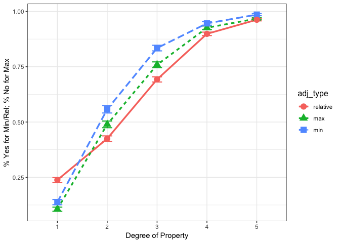

Specify the full model.

``` r
Exp2_reduced <- target_ratings_Exp2[,c("value2", "adj_type", "degree2", "subject", "item", "noun", "adjective", "pict_order")]

fullmodel.afex <- mixed(value2 ~ adj_type * degree2 + pict_order +
                     (1|subject) +  
                     (1|adjective) +
                     (1|noun),
                   data = Exp2_reduced, method = "LRT", family = binomial, control = glmerControl(optimizer = "bobyqa"))
```

    ## Fitting 5 (g)lmer() models:
    ## [.....]

``` r
summary(fullmodel.afex)
```

    ## Generalized linear mixed model fit by maximum likelihood (Laplace
    ##   Approximation) [glmerMod]
    ##  Family: binomial  ( logit )
    ## Formula: value2 ~ adj_type * degree2 + pict_order + (1 | subject) + (1 |  
    ##     adjective) + (1 | noun)
    ##    Data: data
    ## Control: glmerControl(optimizer = "bobyqa")
    ## 
    ##      AIC      BIC   logLik deviance df.resid 
    ##  11843.7  11992.1  -5902.9  11805.7    18154 
    ## 
    ## Scaled residuals: 
    ##      Min       1Q   Median       3Q      Max 
    ## -105.818   -0.257    0.102    0.319   26.305 
    ## 
    ## Random effects:
    ##  Groups    Name        Variance Std.Dev.
    ##  noun      (Intercept) 1.9987   1.4137  
    ##  subject   (Intercept) 0.4033   0.6351  
    ##  adjective (Intercept) 0.2415   0.4914  
    ## Number of obs: 18173, groups:  noun, 103; subject, 72; adjective, 28
    ## 
    ## Fixed effects:
    ##                    Estimate Std. Error z value Pr(>|z|)    
    ## (Intercept)         1.47960    0.19601   7.549 4.40e-14 ***
    ## adj_type1          -0.14128    0.25091  -0.563  0.57339    
    ## adj_type2          -0.16591    0.25855  -0.642  0.52108    
    ## degree21           -3.85458    0.06781 -56.844  < 2e-16 ***
    ## degree22           -1.53290    0.04921 -31.149  < 2e-16 ***
    ## degree23            0.20220    0.05141   3.933 8.37e-05 ***
    ## degree24            1.94533    0.06906  28.170  < 2e-16 ***
    ## pict_order1         0.11223    0.14299   0.785  0.43252    
    ## adj_type1:degree21  0.80807    0.08086   9.993  < 2e-16 ***
    ## adj_type2:degree21 -0.47927    0.09482  -5.054 4.32e-07 ***
    ## adj_type1:degree22 -0.31401    0.06361  -4.937 7.95e-07 ***
    ## adj_type2:degree22  0.18788    0.06808   2.760  0.00579 ** 
    ## adj_type1:degree23 -0.38313    0.06501  -5.894 3.78e-09 ***
    ## adj_type2:degree23  0.18829    0.07091   2.655  0.00793 ** 
    ## adj_type1:degree24 -0.12940    0.08640  -1.498  0.13423    
    ## adj_type2:degree24  0.20099    0.09480   2.120  0.03399 *  
    ## ---
    ## Signif. codes:  0 '***' 0.001 '**' 0.01 '*' 0.05 '.' 0.1 ' ' 1

``` r
fullmodel.afex
```

    ## Mixed Model Anova Table (Type 3 tests, LRT-method)
    ## 
    ## Model: value2 ~ adj_type * degree2 + pict_order + (1 | subject) + (1 | 
    ## Model:     adjective) + (1 | noun)
    ## Data: Exp2_reduced
    ## Df full model: 19
    ##             Effect df       Chisq p.value
    ## 1         adj_type  2        1.21     .55
    ## 2          degree2  4 9352.70 ***  <.0001
    ## 3       pict_order  1        0.62     .43
    ## 4 adj_type:degree2  8  179.58 ***  <.0001
    ## ---
    ## Signif. codes:  0 '***' 0.001 '**' 0.01 '*' 0.05 '+' 0.1 ' ' 1

Combine Exp 1 and 2
===================

``` r
target_ratings_Exp1$Exp <- "Exp1"
target_ratings_Exp1$series <- factor(paste(target_ratings_Exp1$series, target_ratings_Exp1$Exp, sep="-"))
target_ratings_Exp1$group <- factor(paste(target_ratings_Exp1$group, target_ratings_Exp1$Exp, sep="-"))

target_ratings_Exp2$Exp <- "Exp2"
target_ratings_Exp2$series <- factor(paste(target_ratings_Exp2$series, target_ratings_Exp2$Exp, sep="-"))
target_ratings_Exp2$group <- factor(paste(target_ratings_Exp2$group, target_ratings_Exp2$Exp, sep="-"))

#If the numbers of factors in 'noun' and 'series' don't match, some nouns in Exp1 and Exp2 have the same names. Fix that:
target_ratings_Exp1$noun <- revalue(target_ratings_Exp1$noun, (c(auge="geschlossen-auge", 
                                           flasche="geschlossen-flasche",
                                           haare="glatt-haare",
                                           handtuch="nass-handtuch",
                                           jacke="geschlossen-jacke",
                                           schokolade="gross-schokolade",
                                           stein="schwer-stein"
                                           )))

adjectives <- rbind(target_ratings_Exp1, target_ratings_Exp2)
adjectives$Exp <- as.factor(adjectives$Exp)
adjectives$noun <- as.factor(adjectives$noun)

write.csv(adjectives, file = "AdjectivesBoth.csv")
```

In total, 187 adjective-noun pairs (series) were tested. In Exp1 we had 'spitz', in Exp2 'scharf', so now 'adjective' has 29 levels.

``` r
str(adjectives)
```

    ## 'data.frame':    33660 obs. of  18 variables:
    ##  $ subject      : Factor w/ 144 levels "556db1d1fdf99b26054b1774",..: 35 43 46 31 17 42 22 9 49 64 ...
    ##  $ item         : Factor w/ 935 levels "b1__item_1.dick..left.right...Q1.9.1...Q1.9.1",..: 81 81 81 81 81 81 81 81 81 81 ...
    ##  $ value        : int  1 1 1 1 1 1 1 1 NA 1 ...
    ##  $ measure      : Factor w/ 1 level "rating": 1 1 1 1 1 1 1 1 1 1 ...
    ##  $ item_type    : Factor w/ 1 level "target": 1 1 1 1 1 1 1 1 1 1 ...
    ##  $ pict_order   : Factor w/ 2 levels "leftno_rightyes",..: 2 2 2 2 2 2 2 2 2 2 ...
    ##  $ adjective    : Factor w/ 29 levels "dick","dreckig",..: 7 7 7 7 7 7 7 7 7 7 ...
    ##  $ adj_type     : Factor w/ 3 levels "relative","max",..: 2 2 2 2 2 2 2 2 2 2 ...
    ##  $ pict_position: int  1 1 1 1 1 1 1 1 1 1 ...
    ##  $ noun         : Factor w/ 187 levels "angelhaken","apfelsaft",..: 4 4 4 4 4 4 4 4 4 4 ...
    ##  $ group        : Factor w/ 4 levels "Abs-Exp1","Rel-Exp1",..: 1 1 1 1 1 1 1 1 1 1 ...
    ##  $ series       : Factor w/ 187 levels "Abs1-b1__item_1-Exp1",..: 9 9 9 9 9 9 9 9 9 9 ...
    ##  $ newcol       : Factor w/ 10 levels "leftno_rightyes_01",..: 6 6 6 6 6 6 6 6 6 6 ...
    ##  $ degree       : int  5 5 5 5 5 5 5 5 5 5 ...
    ##  $ block        : Factor w/ 4 levels "b1","b2","b3",..: 1 1 1 1 1 1 1 1 1 1 ...
    ##  $ degree2      : Factor w/ 5 levels "1","2","3","4",..: 1 1 1 1 1 1 1 1 1 1 ...
    ##  $ value2       : int  0 0 0 0 0 0 0 0 NA 0 ...
    ##  $ Exp          : Factor w/ 2 levels "Exp1","Exp2": 1 1 1 1 1 1 1 1 1 1 ...

Plot the combined data:

``` r
#adjectives <- read.csv("AdjectivesBoth.csv")

adjectives_NoNA <- na.omit(adjectives)

source(file = "Helper_functions-within-subjects-se.R")
datac <- summarySEwithin(adjectives_NoNA, measurevar="value2", withinvars=c("degree2", "adj_type"), idvar="subject")

ggplot(datac, aes(x=degree2, y=value2, group=adj_type, colour=adj_type)) +
  geom_errorbar(aes(ymin=value2-se, ymax=value2+se), size=.75, width=.2) +
  geom_line(aes(linetype=adj_type), size=1.2) +
  geom_point(aes(shape=adj_type), size=4) + theme_bw() +
  theme(legend.key = element_blank(), legend.title = element_text(size=12)) +
  xlab("Degree of Property") + ylab("% Yes for Min/Rel; % No for Max")
```

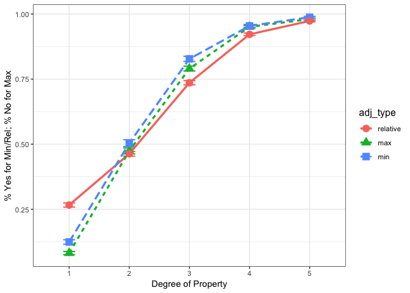

There is no main effect of experiment:

``` r
adjectives_reduced <- adjectives[,c("value2", "adj_type", "degree2", "subject", "item", "noun", "adjective", "pict_order", "Exp")]

fullmodel.afex <- mixed(value2 ~ adj_type * degree2 + pict_order + Exp +
                     (1|subject) +  
                     (1|adjective) +
                     (1|noun),
                   data = adjectives_reduced, method = "LRT", family = binomial, control = glmerControl(optimizer = "bobyqa"))
```

    ## Fitting 6 (g)lmer() models:
    ## [......]

``` r
summary(fullmodel.afex)
```

    ## Generalized linear mixed model fit by maximum likelihood (Laplace
    ##   Approximation) [glmerMod]
    ##  Family: binomial  ( logit )
    ## Formula: value2 ~ adj_type * degree2 + pict_order + Exp + (1 | subject) +  
    ##     (1 | adjective) + (1 | noun)
    ##    Data: data
    ## Control: glmerControl(optimizer = "bobyqa")
    ## 
    ##      AIC      BIC   logLik deviance df.resid 
    ##  20417.1  20585.2 -10188.6  20377.1    33056 
    ## 
    ## Scaled residuals: 
    ##      Min       1Q   Median       3Q      Max 
    ## -146.716   -0.226    0.092    0.291   36.893 
    ## 
    ## Random effects:
    ##  Groups    Name        Variance Std.Dev.
    ##  noun      (Intercept) 1.7929   1.3390  
    ##  subject   (Intercept) 0.4655   0.6823  
    ##  adjective (Intercept) 0.4903   0.7002  
    ## Number of obs: 33076, groups:  noun, 187; subject, 144; adjective, 29
    ## 
    ## Fixed effects:
    ##                     Estimate Std. Error z value Pr(>|z|)    
    ## (Intercept)         1.642575   0.186437   8.810  < 2e-16 ***
    ## adj_type1          -0.006217   0.234976  -0.026 0.978892    
    ## adj_type2          -0.167211   0.254061  -0.658 0.510441    
    ## degree21           -4.128148   0.055559 -74.302  < 2e-16 ***
    ## degree22           -1.725173   0.039492 -43.684  < 2e-16 ***
    ## degree23            0.227256   0.040995   5.543 2.97e-08 ***
    ## degree24            2.155457   0.058041  37.137  < 2e-16 ***
    ## pict_order1         0.026071   0.101531   0.257 0.797346    
    ## Exp1                0.108679   0.116347   0.934 0.350258    
    ## adj_type1:degree21  0.989647   0.064417  15.363  < 2e-16 ***
    ## adj_type2:degree21 -0.647275   0.078492  -8.246  < 2e-16 ***
    ## adj_type1:degree22 -0.141579   0.049547  -2.858 0.004270 ** 
    ## adj_type2:degree22  0.136811   0.055143   2.481 0.013101 *  
    ## adj_type1:degree23 -0.370533   0.050830  -7.290 3.11e-13 ***
    ## adj_type2:degree23  0.195105   0.057624   3.386 0.000710 ***
    ## adj_type1:degree24 -0.305112   0.070752  -4.312 1.61e-05 ***
    ## adj_type2:degree24  0.281804   0.082060   3.434 0.000595 ***
    ## ---
    ## Signif. codes:  0 '***' 0.001 '**' 0.01 '*' 0.05 '.' 0.1 ' ' 1

``` r
fullmodel.afex
```

    ## Mixed Model Anova Table (Type 3 tests, LRT-method)
    ## 
    ## Model: value2 ~ adj_type * degree2 + pict_order + Exp + (1 | subject) + 
    ## Model:     (1 | adjective) + (1 | noun)
    ## Data: adjectives_reduced
    ## Df full model: 20
    ##             Effect df        Chisq p.value
    ## 1         adj_type  2         0.52     .77
    ## 2          degree2  4 17851.41 ***  <.0001
    ## 3       pict_order  1         0.07     .80
    ## 4              Exp  1         0.87     .35
    ## 5 adj_type:degree2  8   351.17 ***  <.0001
    ## ---
    ## Signif. codes:  0 '***' 0.001 '**' 0.01 '*' 0.05 '+' 0.1 ' ' 1

Look at the variation between adjectives:

Look at the variation between adjectives:

In Experiment 1: 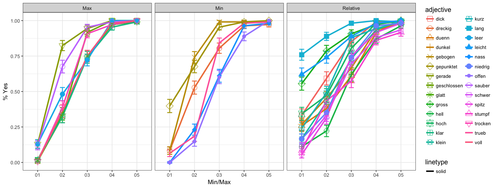

In Experiment 2: 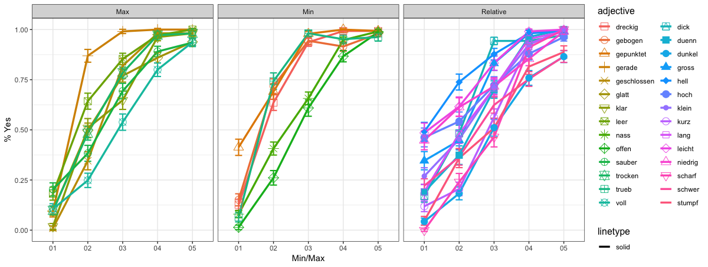

In both experiments: 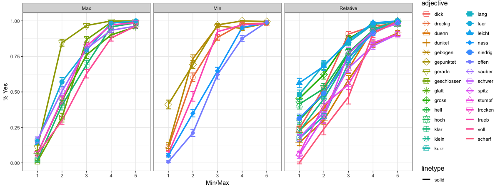

Max adjectives in both experiments: 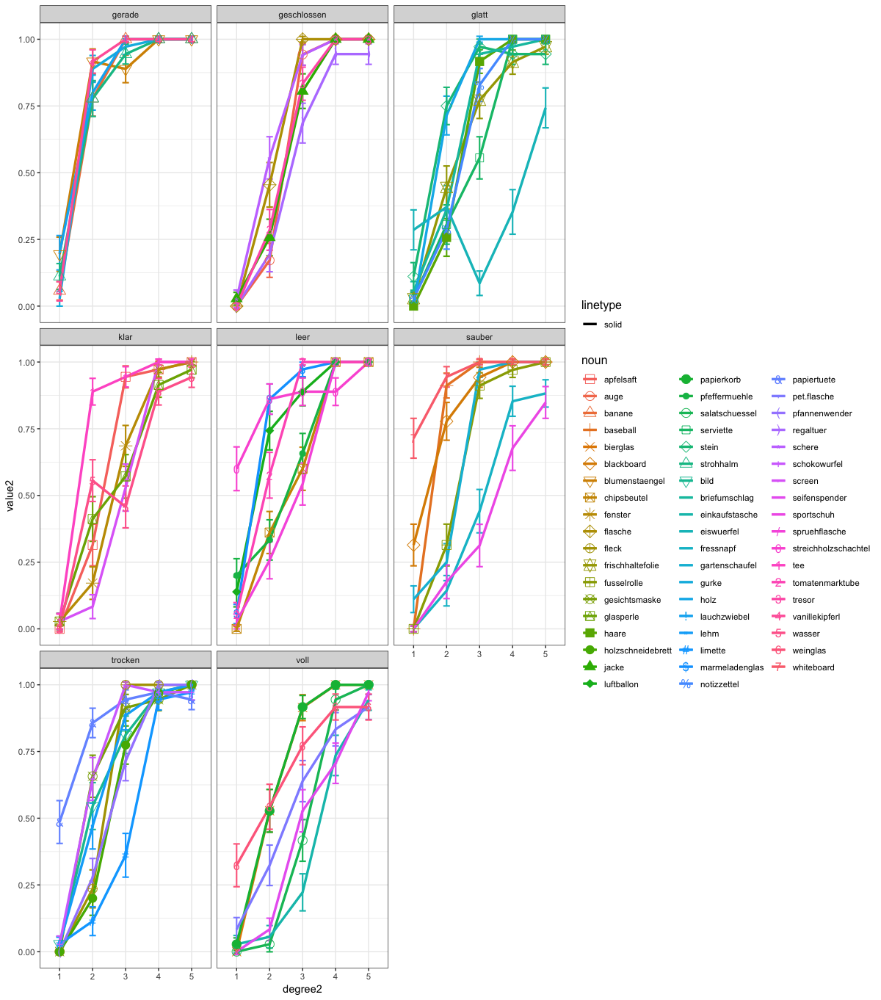

Min adjectives in both experiments: 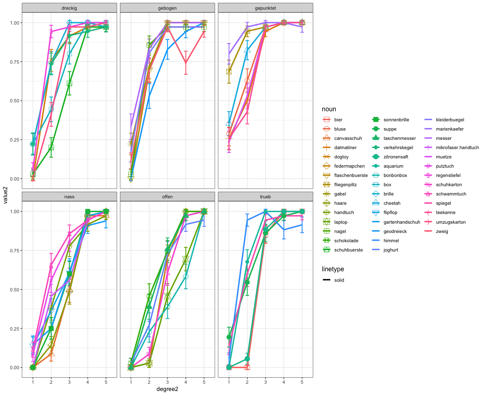

Rel adjectives in both experiments: 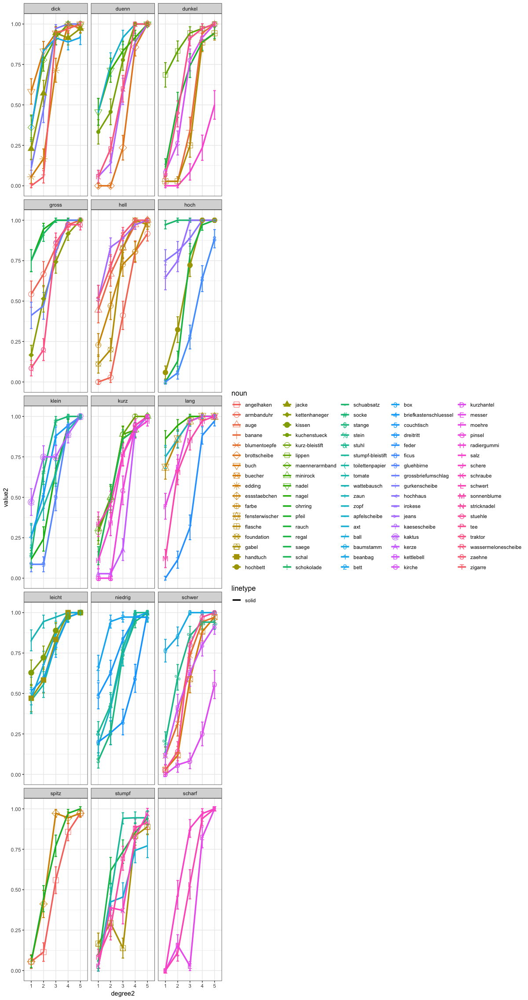

Decision Trees (Random Forest) to find groupings among adjective-noun pairs (series)?
=====================================================================================

``` r
# Aggregate data:
adj_PYes <- summarySEwithin(adjectives_NoNA, measurevar="value2", 
                               withinvars=c("degree2", "adjective", "noun", "series", "adj_type", 
                                            "Exp"),
                               idvar="subject")
#nrow(adj_PYes)
adj_PYes <- adj_PYes[order(adj_PYes$adjective, adj_PYes$noun),]
#normed mean (with same between-group mean)
names(adj_PYes)[names(adj_PYes) == 'value2'] <- 'PYes'
names(adj_PYes)[names(adj_PYes) == 'value2_norm'] <- 'PYes_norm'
adj_PYes$series2 <- factor(paste(adj_PYes$adjective, adj_PYes$noun, adj_PYes$adj_type, sep="-"))
str(adj_PYes)
```

    ## 'data.frame':    935 obs. of  13 variables:
    ##  $ degree2  : Factor w/ 5 levels "1","2","3","4",..: 1 2 3 4 5 1 2 3 4 5 ...
    ##  $ adjective: Factor w/ 29 levels "dick","dreckig",..: 1 1 1 1 1 1 1 1 1 1 ...
    ##  $ noun     : Factor w/ 187 levels "angelhaken","apfelsaft",..: 13 13 13 13 13 20 20 20 20 20 ...
    ##  $ series   : Factor w/ 187 levels "Abs1-b1__item_1-Exp1",..: 43 43 43 43 43 57 57 57 57 57 ...
    ##  $ adj_type : Factor w/ 3 levels "relative","max",..: 1 1 1 1 1 1 1 1 1 1 ...
    ##  $ Exp      : Factor w/ 2 levels "Exp1","Exp2": 1 1 1 1 1 1 1 1 1 1 ...
    ##  $ N        : num  36 36 36 36 36 36 36 35 36 36 ...
    ##  $ PYes     : num  0.583 0.833 0.944 0.972 1 ...
    ##  $ PYes_norm: num  0.547 0.797 0.908 0.936 0.964 ...
    ##  $ sd       : num  0.4713 0.3545 0.2069 0.1905 0.0783 ...
    ##  $ se       : num  0.0786 0.0591 0.0345 0.0318 0.0131 ...
    ##  $ ci       : num  0.1595 0.12 0.07 0.0645 0.0265 ...
    ##  $ series2  : Factor w/ 187 levels "dick-beanbag-relative",..: 2 2 2 2 2 3 3 3 3 3 ...

``` r
adj_PYes$series2_exp <- factor(paste(adj_PYes$series2, adj_PYes$Exp, sep="-"))


write.csv(adj_PYes, file = "adjectives_PYes.csv")

#adj_PYes <- read.csv("adjectives_PYes.csv")
```

``` r
ggplot(adj_PYes, aes(x = degree2, y = PYes, group=adj_type, colour=adj_type)) +
  geom_point() + geom_smooth(method = 'lm')
```

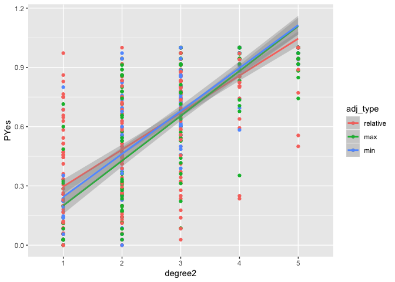

``` r
library(party)# for conditional inference trees
library(ranger) # for random forests
# Fit the tree (for all degrees):

#mytree <- ctree(PYes ~ adj_type + noun + series, data = adj_PYes) #==> no branching

mytree <- ctree(PYes ~ adjective + noun, data = adj_PYes)

# Plot the tree:

plot(mytree)
```

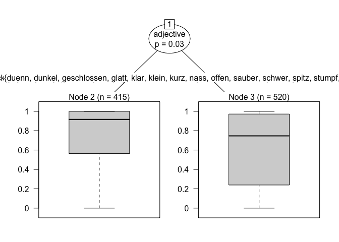

``` r
# Read the tree:

mytree
```

    ## 
    ##   Conditional inference tree with 2 terminal nodes
    ## 
    ## Response:  PYes 
    ## Inputs:  adjective, noun 
    ## Number of observations:  935 
    ## 
    ## 1) adjective == {dick, dreckig, gebogen, gepunktet, gerade, gross, hell, hoch, lang, leer, leicht, niedrig, trueb}; criterion = 0.97, statistic = 147.173
    ##   2)*  weights = 415 
    ## 1) adjective == {duenn, dunkel, geschlossen, glatt, klar, klein, kurz, nass, offen, sauber, schwer, spitz, stumpf, trocken, voll, scharf}
    ##   3)*  weights = 520

We see absolute and relative on both branches: 1: *dick*, **dreckig, gebogen, gepunktet, gerade**, *gross, hell, hoch, lang*, **leer**, *leicht, niedrig*, **trueb** 2: *duenn, dunkel*, **geschlossen, glatt, klar**, *klein, kurz*, **nass, offen, sauber**, *scharf, schwer, spitz, stumpf*, **trocken, voll**

**Fit the tree for degree 1:**

``` r
degree1 <- droplevels(subset(adj_PYes, degree2=="1"))

mytree <- ctree(PYes ~ adj_type + noun + series, data = degree1)
mytree
```

    ## 
    ##   Conditional inference tree with 2 terminal nodes
    ## 
    ## Response:  PYes 
    ## Inputs:  adj_type, noun, series 
    ## Number of observations:  187 
    ## 
    ## 1) adj_type == {relative}; criterion = 1, statistic = 186
    ##   2)*  weights = 88 
    ## 1) adj_type == {max, min}
    ##   3)*  weights = 99

``` r
mytree <- ctree(PYes ~ adjective + noun, data = degree1)
mytree
```

    ## 
    ##   Conditional inference tree with 2 terminal nodes
    ## 
    ## Response:  PYes 
    ## Inputs:  adjective, noun 
    ## Number of observations:  187 
    ## 
    ## 1) adjective == {gepunktet, gross, hell, hoch, lang, leicht, niedrig}; criterion = 1, statistic = 186
    ##   2)*  weights = 43 
    ## 1) adjective == {dick, dreckig, duenn, dunkel, gebogen, gerade, geschlossen, glatt, klar, klein, kurz, leer, nass, offen, sauber, schwer, spitz, stumpf, trocken, trueb, voll, scharf}
    ##   3)*  weights = 144

**Fit the tree for degree 2:**

``` r
degree2 <- droplevels(subset(adj_PYes, degree2=="2"))

#mytree <- ctree(PYes ~ adj_type + noun + series, data = degree2)   #no branching

mytree <- ctree(PYes ~ adjective + noun, data = degree2)
mytree
```

    ## 
    ##   Conditional inference tree with 2 terminal nodes
    ## 
    ## Response:  PYes 
    ## Inputs:  adjective, noun 
    ## Number of observations:  187 
    ## 
    ## 1) adjective == {dreckig, gebogen, gepunktet, gerade, gross, lang, leer, leicht}; criterion = 0.996, statistic = 186
    ##   2)*  weights = 52 
    ## 1) adjective == {dick, duenn, dunkel, geschlossen, glatt, hell, hoch, klar, klein, kurz, nass, niedrig, offen, sauber, schwer, spitz, stumpf, trocken, trueb, voll, scharf}
    ##   3)*  weights = 135

**Fit the tree for degree 3:**

``` r
degree3 <- droplevels(subset(adj_PYes, degree2=="3"))

#mytree <- ctree(PYes ~ adj_type + noun + series, data = degree3)   #no branching

mytree <- ctree(PYes ~ adjective + noun, data = degree3)
mytree
```

    ## 
    ##   Conditional inference tree with 2 terminal nodes
    ## 
    ## Response:  PYes 
    ## Inputs:  adjective, noun 
    ## Number of observations:  187 
    ## 
    ## 1) adjective == {dick, dreckig, gebogen, gepunktet, gerade, geschlossen, glatt, gross, hell, hoch, lang, leer, leicht, sauber, spitz, trocken, trueb}; criterion = 0.995, statistic = 186
    ##   2)*  weights = 110 
    ## 1) adjective == {duenn, dunkel, klar, klein, kurz, nass, niedrig, offen, schwer, stumpf, voll, scharf}
    ##   3)*  weights = 77

**Fit the tree for degree 4:**

``` r
#degree4 <- droplevels(subset(adj_PYes, degree2=="4"))

#mytree <- ctree(PYes ~ adj_type + noun + series, data = degree4)   #no branching

#mytree <- ctree(PYes ~ adjective + noun, data = degree4) #no branching
```

**Fit the tree for degree 5:**

``` r
#degree5 <- droplevels(subset(adj_PYes, degree2=="5"))

#mytree <- ctree(PYes ~ adj_type + noun + series, data = degree5)   #no branching

#mytree <- ctree(PYes ~ adjective + noun, data = degree5) #no branching
```

Look for CLUSTERS among adjective-noun pairs (series)
=====================================================

How many clusters?
==================

The procedure for clustering time series shows us we have 3 clusters. We then ask the KMeans algorithm to group the data into 3 clusters. <https://petolau.github.io/TSrepr-clustering-time-series-representations/>

``` r
library(TSrepr)
library(ggplot2)
library(data.table)
library(cluster)
library(clusterCrit)
library(reshape2)

#adj_PYes <- read.csv("adjectives_PYes.csv")
reduced <- adj_PYes[,c("degree2", "PYes", "series2")]
my.matrix <- acast(reduced, series2~degree2, value.var="PYes")

clusterings <- lapply(c(2:7), function(x)
  pam(my.matrix, x))

DB_values <- sapply(seq_along(clusterings), function(x) 
  intCriteria(my.matrix, as.integer(clusterings[[x]]$clustering),
              c("Davies_Bouldin")))

ggplot(data.table(Clusters = 2:7, DBindex = unlist(DB_values)),
       aes(Clusters, DBindex)) +
  geom_line(size = 1) +
  geom_point(size = 3) +
  theme_bw()
```

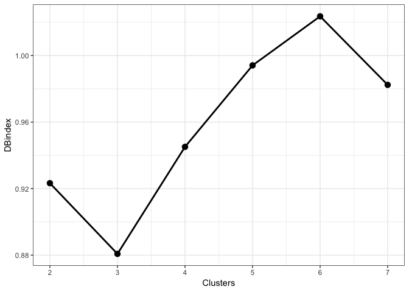

The “best” number of clusters is 3 (lowest value of the index).

Let's plot them:

``` r
reduced2 <- reshape(reduced, idvar = "series2", timevar = "degree2", direction = "wide")
str(reduced2)
```

    ## 'data.frame':    187 obs. of  6 variables:
    ##  $ series2: Factor w/ 187 levels "dick-beanbag-relative",..: 2 3 6 1 4 5 7 10 12 14 ...
    ##  $ PYes.1 : num  0.5833 0.0556 0.3611 0.3529 0.1111 ...
    ##  $ PYes.2 : num  0.833 0.167 0.778 0.833 0.472 ...
    ##  $ PYes.3 : num  0.944 0.714 0.917 0.914 0.972 ...
    ##  $ PYes.4 : num  0.972 1 1 0.889 1 ...
    ##  $ PYes.5 : num  1 0.972 1 0.917 1 ...
    ##  - attr(*, "reshapeWide")=List of 5
    ##   ..$ v.names: NULL
    ##   ..$ timevar: chr "degree2"
    ##   ..$ idvar  : chr "series2"
    ##   ..$ times  : Factor w/ 5 levels "1","2","3","4",..: 1 2 3 4 5
    ##   ..$ varying: chr [1, 1:5] "PYes.1" "PYes.2" "PYes.3" "PYes.4" ...

``` r
data_plot <- data.table(melt(data.table(class = as.factor(clusterings[[2]]$clustering),
                                        reduced2)))
data_plot[, Time := rep(1:ncol(my.matrix), each = nrow(my.matrix))]
data_plot[, ID := rep(1:nrow(my.matrix), ncol(my.matrix))]

# prepare medoids
centers <- data.table(melt(clusterings[[2]]$medoids))
setnames(centers, c("Var1", "Var2"), c("class", "Time"))
centers[, ID := class]

# plot the results
ggplot(data_plot, aes(Time, value, group = ID)) +
  facet_wrap(~class, ncol = 2, scales = "free_y") +
  geom_line(color = "grey10", alpha = 0.65) +
  geom_line(data = centers, aes(Time, value),
            color = "firebrick1", alpha = 0.80, size = 1.2) +
  labs(x = "Degree", y = "series2") +
  theme_bw()
```

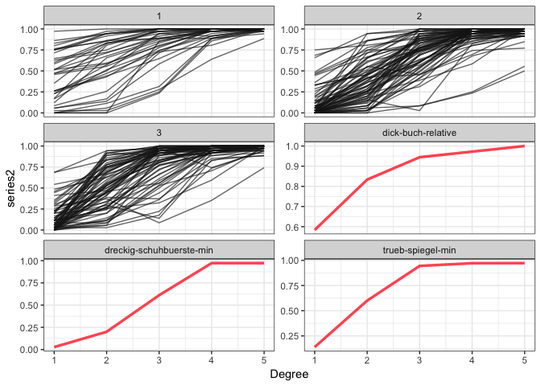

You can read out the adjective-noun pairs in each cluster:

``` r
# data_plot <- data_plot[order(data_plot$class, data_plot$series2),]
# write.csv(data_plot, file = "AdjectivesClusters.csv")
```

KMeans to find clusters
=======================

``` r
reduced <- adj_PYes[,c("degree2", "PYes", "series2_exp")]
#reduced$series2_exp <- factor(paste(reduced$series2, reduced$Exp, sep="-"))
#reduced$series2 <- NULL
#reduced$Exp <- NULL

reduced2 <- reshape(reduced, idvar = "series2_exp", timevar = "degree2", direction = "wide")
reduced3 <- reduced2
reduced3$series2_exp <- NULL

clust <- kmeans(x=reduced3, centers=3, iter.max=100, nstart=10)
# K-means clustering with 3 clusters of sizes 68, 82, 37

clust$centers
```

    ##       PYes.1    PYes.2    PYes.3    PYes.4    PYes.5
    ## 1 0.58267159 0.8015879 0.9238745 0.9804376 0.9947447
    ## 2 0.11078266 0.5645528 0.8969139 0.9669883 0.9894007
    ## 3 0.04215549 0.1879735 0.5364656 0.8771308 0.9564133

``` r
length(clust$cluster)
```

    ## [1] 187

The clustering vector tells us for each data point to which cluster it belongs.

``` r
reduced2_clustered <- data.frame(reduced2, cluster=factor(clust$cluster))
reduced2_clustered_long <- melt(reduced2_clustered, id.vars = c("series2_exp", "cluster"))
names(reduced2_clustered_long)[names(reduced2_clustered_long)=="variable"] <- "degree2"

ggplot(reduced2_clustered_long, aes(x=degree2, y=value, group=series2_exp, color=cluster, alpha=I(0.4))) + 
  geom_line(size=1.2) + 
  geom_point(aes(shape=cluster), size=4) + theme_bw() +
  scale_colour_manual(values=c("orange1", "gray20", "darkorchid2")) +
  scale_x_discrete(breaks=c("PYes.1", "PYes.2", "PYes.3", "PYes.4", "PYes.5"),
                      labels=c("1", "2", "3", "4", "5")) +
  #theme(legend.key = element_blank(), legend.title = element_text(size=12)) +
  xlab("Degree of Property") + ylab("% Yes for Min/Rel; % No for Max") #+
```

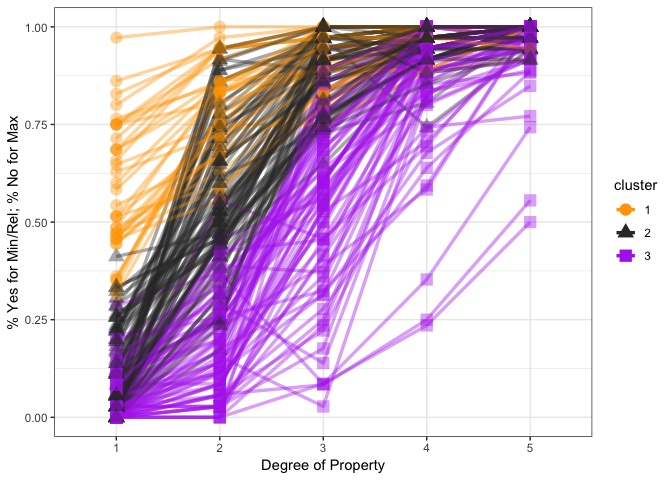

``` r
  #theme(legend.position="top")

#ggsave('AdjectiveClustersExp1-2.png', width = 6, height = 4) 
```

**Which types of adjectives in each cluster?**

``` r
reduced2_clustered_long <- arrange(reduced2_clustered_long, series2_exp, degree2)
adj_PYes <- arrange(adj_PYes, series2_exp, degree2)

reduced2_clustered_long$adj_type <- adj_PYes$adj_type
reduced2_clustered_long$adjective <- adj_PYes$adjective
reduced2_clustered_long$noun <- adj_PYes$noun
reduced2_clustered_long$Exp <- adj_PYes$Exp


#cluster1 <- droplevels(subset(reduced2_clustered_long, cluster=="1"))
labels <- c("1" = "Cluster 1", "2" = "Cluster 2", "3" = "Cluster 3")

ggplot(reduced2_clustered_long, aes(x=degree2, y=value, group=series2_exp, color=adj_type, alpha=I(0.4))) + 
  geom_line(size=1.2) + 
  geom_point(aes(shape=cluster), size=4) + theme_bw() +
  facet_wrap(~cluster, labeller=labeller(cluster = labels)) +
  scale_x_discrete(breaks=c("PYes.1", "PYes.2", "PYes.3", "PYes.4", "PYes.5"),
                      labels=c("1", "2", "3", "4", "5")) +
  #theme(legend.key = element_blank(), legend.title = element_text(size=12)) +
  xlab("Degree of Property") + ylab("% Yes for Min/Rel; % No for Max")
```

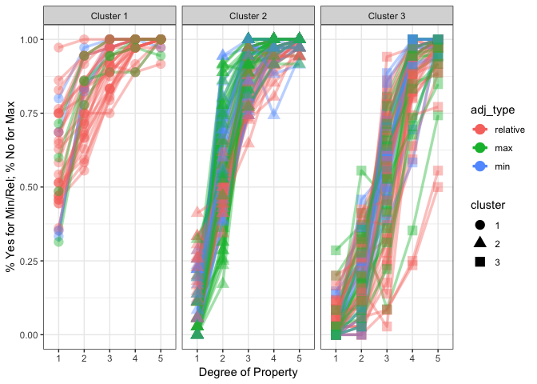

``` r
ggsave('AdjectiveTypesClustersExp1-2.png', width = 9, height = 3) 
```

You can read out the adjective-noun pairs in each cluster:

``` r
# reduced2_clustered_long <- reduced2_clustered_long[order(reduced2_clustered_long$cluster, reduced2_clustered_long$series2_exp, reduced2_clustered_long$degree2),]
# write.csv(reduced2_clustered_long, file = "AdjectivesClusters2.csv")
```

How many adjectives in each cluster?   In cluster 1, there are 16 adjectives (11 rel, 3 max, 2 min).  In cluster 2, there are 27 adjectives (13 rel, 8 max, 6 min).  In cluster 3, there are 25 adjectives (14 rel, 7 max, 4 min).  **We choose cluster 2 for the EEG experiment.**

``` r
in.clusters <- unique(reduced2_clustered_long[, c("cluster", "adj_type","adjective")])

cluster1 <- droplevels(subset(in.clusters, cluster=="1"))
cluster2 <- droplevels(subset(in.clusters, cluster=="2"))
cluster3 <- droplevels(subset(in.clusters, cluster=="3"))
# nrow(cluster1)
# nrow(cluster2)
# nrow(cluster3)
table(in.clusters$cluster)
```

    ## 
    ##  1  2  3 
    ## 16 27 25

``` r
table(cluster1$adj_type)
```

    ## 
    ## relative      max      min 
    ##       11        3        2

``` r
table(cluster2$adj_type)
```

    ## 
    ## relative      max      min 
    ##       13        8        6

``` r
table(cluster3$adj_type)
```

    ## 
    ## relative      max      min 
    ##       14        7        4

``` r
in.clusters[order(in.clusters$cluster, in.clusters$adj_type),]
```

    ##     cluster adj_type   adjective
    ## 1         1 relative        dick
    ## 71        1 relative       duenn
    ## 121       1 relative      dunkel
    ## 306       1 relative       gross
    ## 336       1 relative        hell
    ## 376       1 relative        hoch
    ## 436       1 relative       klein
    ## 496       1 relative        lang
    ## 556       1 relative      leicht
    ## 631       1 relative     niedrig
    ## 746       1 relative      schwer
    ## 546       1      max        leer
    ## 701       1      max      sauber
    ## 856       1      max     trocken
    ## 156       1      min     gebogen
    ## 176       1      min   gepunktet
    ## 16        2 relative        dick
    ## 86        2 relative       duenn
    ## 106       2 relative      dunkel
    ## 321       2 relative       gross
    ## 341       2 relative        hell
    ## 426       2 relative       klein
    ## 461       2 relative        kurz
    ## 511       2 relative        lang
    ## 651       2 relative     niedrig
    ## 736       2 relative      scharf
    ## 771       2 relative      schwer
    ## 786       2 relative       spitz
    ## 801       2 relative      stumpf
    ## 206       2      max      gerade
    ## 236       2      max geschlossen
    ## 266       2      max       glatt
    ## 396       2      max        klar
    ## 526       2      max        leer
    ## 696       2      max      sauber
    ## 826       2      max     trocken
    ## 901       2      max        voll
    ## 36        2      min     dreckig
    ## 136       2      min     gebogen
    ## 171       2      min   gepunktet
    ## 611       2      min        nass
    ## 681       2      min       offen
    ## 871       2      min       trueb
    ## 11        3 relative        dick
    ## 76        3 relative       duenn
    ## 101       3 relative      dunkel
    ## 331       3 relative       gross
    ## 346       3 relative        hell
    ## 366       3 relative        hoch
    ## 431       3 relative       klein
    ## 456       3 relative        kurz
    ## 491       3 relative        lang
    ## 641       3 relative     niedrig
    ## 731       3 relative      scharf
    ## 751       3 relative      schwer
    ## 781       3 relative       spitz
    ## 796       3 relative      stumpf
    ## 246       3      max geschlossen
    ## 271       3      max       glatt
    ## 401       3      max        klar
    ## 521       3      max        leer
    ## 706       3      max      sauber
    ## 841       3      max     trocken
    ## 906       3      max        voll
    ## 56        3      min     dreckig
    ## 586       3      min        nass
    ## 661       3      min       offen
    ## 876       3      min       trueb

How many adjective-noun pairs (series) in each cluster?   In cluster 1, there are 37 nouns.  In cluster 2, there are 82 nouns.  In cluster 3, there are 68 nouns.  **We choose cluster 2 for the EEG experiment.**

``` r
nouns.clusters <- unique(reduced2_clustered_long[, c("cluster", "adj_type","adjective", "noun")])
table(nouns.clusters$cluster)
```

    ## 
    ##  1  2  3 
    ## 37 82 68

``` r
#nouns.clusters[order(nouns.clusters$cluster, nouns.clusters$adj_type),]
```

How many from each experiment?

``` r
exp.clusters <- unique(reduced2_clustered_long[, c("cluster", "adj_type","adjective", "noun", "Exp")])

xcluster1 <- droplevels(subset(exp.clusters, cluster=="1"))
xcluster2 <- droplevels(subset(exp.clusters, cluster=="2"))
xcluster3 <- droplevels(subset(exp.clusters, cluster=="3"))

table(xcluster1$Exp)
```

    ## 
    ## Exp1 Exp2 
    ##   15   22

``` r
table(xcluster2$Exp)
```

    ## 
    ## Exp1 Exp2 
    ##   41   41

``` r
table(xcluster3$Exp)
```

    ## 
    ## Exp1 Exp2 
    ##   28   40

**From cluster 2 we pick the following for the EEG experiment.**  rel dick gurkenscheibe   rel dick edding   rel dick jacke   rel dunkel kirsche   rel dunkel rauch   rel dunkel tee   rel gross armbanduhr   rel gross grossbriefumschlag   rel gross kettenhaenger   rel hell auge   rel hell foundation   rel hell farbe   rel klein briefkastenschluessel   rel klein tomate   rel klein socke   rel kurz minirock   rel kurz schraube   rel kurz schal   rel lang feder   rel lang moehre   rel lang sonnenblume   rel niedrig stange   rel niedrig zaun   rel niedrig stuhl   rel spitz angelhaken   rel spitz essstaebchen   rel spitz pfeil   rel stumpf stricknadel   rel stumpf bleistift   rel stumpf saege   max gerade vanillekipferl   max gerade banane   max gerade strohhalm   max leer luftballon   max leer marmeladenglas   max leer tomatenmarktube   max sauber baseball   max sauber fusselrolle   max sauber gartenschaufel   max trocken gesichtsmaske   max trocken lehm   max trocken fleck   max voll weinglas   max voll bierglas   max voll papierkorb   min dreckig brille   min dreckig dogtoy   min dreckig verkehrskegel   min gebogen gabel   min gebogen kleiderbuegel   min gebogen flaschenbuerste   min gepunktet bluse   min gepunktet teekanne   min gepunktet dalmatiner   min nass handtuch   min nass schwammtuch   min nass putztuch   min trueb aquarium   min trueb spiegel   min trueb suppe
